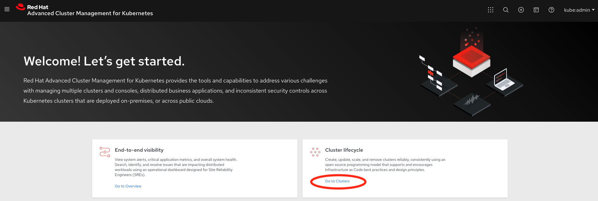
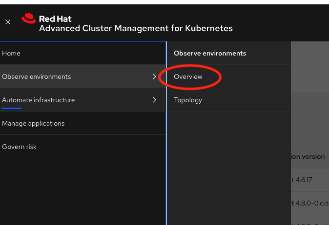
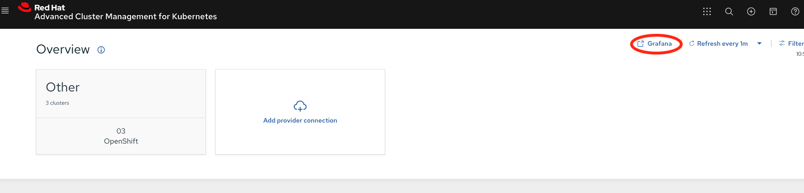
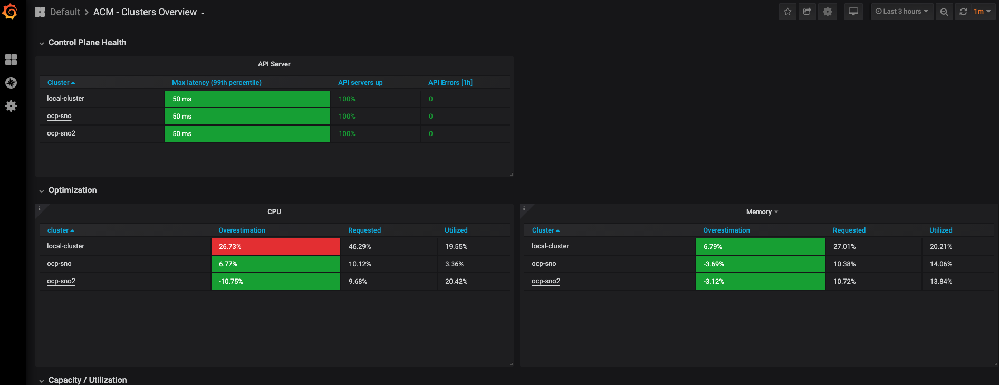

# sno-bip-acm-observability
This repo includes some automation to install a single node OpenShift bootstrap in place cluster and configure observability in ACM.

The pre-requisistes include installing a SNO-BIP cluster and having the following DNS entries in place:


```
$ORIGIN ocp-sno.e2e.bos.redhat.com.
api                     A       10.x.y.200
api-int                 A       10.x.y.200
$ORIGIN apps.ocp-sno.e2e.bos.redhat.com.
*                       A       10.x.y.200
```

Now, clone the repo and follow the steps listed in it:

```
git clone https://github.com/eranco74/bootstrap-in-place-poc
cd bootstrap-in-place-poc
# Create the install-config
vim install-config.yaml

# Create the working directory and stage the install-config
mkdir sno-workdir
cp install-config.yaml sno-workdir/

# Download the base CoreOS live image
./download_live_iso.sh sno-workdir/base.iso

# Generate the ignition and manifests
# 0.3.0 is 4.7 and 0.5.0 is 4.8
INSTALLATION_DISK=/dev/sda \
RELEASE_IMAGE=registry.svc.ci.openshift.org/sno-dev/openshift-bip:0.3.0 \
INSTALLER_BIN=./bin/openshift-install \
INSTALLER_WORKDIR=./sno-workdir \
./generate.sh

# Embed the ISO with the files created above
ISO_PATH=./sno-workdir/base.iso \
IGNITION_PATH=./sno-workdir/bootstrap-in-place-for-live-iso.ign \
OUTPUT_PATH=./sno-workdir/embedded.iso \
./embed.sh

# Run the httpd container and boot to the image via the iDRAC virtual media
DRAC_IP=10.x.y.54 \
DRAC_USER=root \ 
DRAC_PASSWORD=calvin \
INSTALLER_WORKDIR=sno-workdir  \
./bm-dell.sh
```

Once the cluster is installed, install observability on the multicluster hub.

First, create an s3 bucket and use that to install.
```
aws s3api create-bucket --bucket snobip-thanos-object-storage
{
    "Location": "/snobip-thanos-object-storage"
}
```
Now, fill in the bucket name and AWS keys in the installation script provided by Chris Doan

```
cd ..
git clone https://github.com/dav1x/sno-bip-acm-observability
cd sno-bip-acm-observability
MCO_BUCKET=snobip-thanos-object-storage \
MCO_S3_ENDPOINT=s3.amazonaws.com \
MCO_S3_ACCESSKEY=myaccesskey \
MCO_S3_SECRETKEY=supersecretkey \
./install-observability.sh
```

Now, you can logon to the ACM multicluster hub and observe the performance data.






